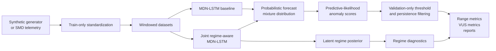

# Anomaly-Aware Forecasting

A reproducible research prototype for probabilistic time series forecasting, anomaly detection, and
regime-aware evaluation on multivariate telemetry.

Built as an end-to-end benchmark suite: synthetic regime-switching data, Server Machine Dataset
preprocessing, MDN-LSTM and joint regime-aware MDN-LSTM models, validation-only thresholding,
range-aware anomaly metrics, comparison reports, and multi-seed robustness checks.

## At A Glance

- Full-SMD benchmark over 28 machines and 38-channel telemetry.
- Probabilistic MDN-LSTM forecasting with diagonal Gaussian mixture emissions.
- Joint model variant with latent regime posterior estimation.
- Validation-only threshold selection; test score distributions are never used for calibration.
- Range-based precision/recall plus VUS-PR/VUS-ROC for anomaly detection.
- 295 automated tests with pytest, Ruff, and mypy gates.
- Final release tag: `v0.1.0`.

## Overview

This project explores an anomaly-aware forecasting system that predicts future time series values while simultaneously estimating latent regimes and flagging anomalous behavior. The core idea is to avoid treating forecasting and anomaly detection as two disconnected pipelines: the forecasting distribution and regime signal should be learned together and evaluated together.

The main model family is an MDN-LSTM with an optional regime head. It produces:

- Probabilistic forecasts using Gaussian mixture outputs
- Posterior probabilities over latent regimes
- Anomaly scores derived from predictive likelihood
- Detection signals for persistent regime shifts and structured sensor failures

## System Design



## Goals

- Build a reproducible Python research prototype for anomaly-aware forecasting.
- Evaluate probabilistic forecasts using NLL, CRPS, calibration diagnostics, and Energy Score for multivariate outputs.
- Evaluate anomaly detection with rigorous time-series metrics such as range-based precision/recall and VUS-PR/VUS-ROC.
- Use synthetic data with held-out generator configurations for controlled ground-truth evaluation.
- Validate the method on the Server Machine Dataset (SMD) as a real-world benchmark.

## Implemented Features

- Synthetic switching time series generator with configurable regimes and failure modes
- SMD ingestion and preprocessing pipeline
- MDN-LSTM forecasting model with diagonal-covariance Gaussian mixture emissions
- Regime posterior estimation and regime-shift detection
- Validation-only threshold selection for reproducible anomaly metrics
- Evaluation harness for forecasting, anomaly detection, and regime detection
- Experiment-suite runner, comparison exports, and anomaly-only rescoring

## Methodological Principles

This project emphasizes disciplined evaluation over leaderboard chasing:

- Test-set thresholds are never used for model or threshold selection.
- Point-adjusted F1 is treated only as a deprecated reference metric.
- Synthetic headline results are reported on held-out generator configurations.
- Standardization statistics are fit on training data only.
- Reported quantitative claims must trace back to reproducible run artifacts.

## Current Results

The strongest current full-SMD anomaly results use channel-max predictive NLL, validation-only
threshold calibration, and 2-of-5 persistence filtering. The final three-seed robustness check is:

| Model | Threshold | Seeds | F1 mean +/- std | Precision mean | Recall mean | ROC-AUC mean | VUS-ROC mean |
| --- | --- | ---: | ---: | ---: | ---: | ---: | ---: |
| Non-regime MDN-LSTM | q99.6 | 3 | 0.2610 +/- 0.0069 | 0.2387 | 0.2880 | 0.7205 | 0.7137 |
| Joint regime-aware MDN-LSTM | q99.3 | 3 | 0.2446 +/- 0.0209 | 0.1993 | 0.3194 | 0.7144 | 0.7049 |

The joint model is competitive with a matched MDN-LSTM baseline, but the final multi-seed full-SMD
check does not show a joint-model win. Most of the absolute gain comes from validation-only
threshold calibration and persistence filtering, so the project reports those controls explicitly
rather than treating them as hidden post-processing.

Detailed CSV reports live in [`reports/`](reports/), especially
[`reports/final_summary.md`](reports/final_summary.md) and
[`reports/summary.csv`](reports/summary.csv).

## Lessons Learned

- Regime-aware modeling can help in controlled synthetic settings, but full SMD favored the simpler
  MDN-LSTM baseline in the final robustness check.
- Validation-only threshold calibration and persistence filtering mattered more than architecture
  choice for full-SMD anomaly F1.
- Selected-machine improvements were not reliable predictors of full 28-machine benchmark results.
- Regime posterior signals were useful for diagnostics, but weak as standalone SMD anomaly scores.
- Negative results were kept in the reports because they are part of the evaluation story, not
  cleanup to hide.

## Development Workflow

Implementation should proceed module by module, with testing treated as part of completion rather than a later cleanup step.

- Each module must be thoroughly tested after completion and before work moves to the next module.
- New features should not be allowed to break previously completed modules.
- Progress should be committed in small, meaningful increments and pushed regularly.
- Avoid large, end-of-feature commits that mix unrelated changes.
- Keep local-only specification documents and experiment artifacts out of Git.

## Local Development Setup

On Windows, use a project-local virtual environment instead of the global Anaconda environment:

```powershell
py -3.13 -m venv .venv
.\.venv\Scripts\python.exe -m pip install --upgrade pip
.\.venv\Scripts\python.exe -m pip install torch --index-url https://download.pytorch.org/whl/cpu
.\.venv\Scripts\python.exe -m pip install numpy scipy pytest mypy ruff hypothesis hatchling
.\.venv\Scripts\python.exe -m pip install -e . --no-deps
```

Run the quality gates from the same environment:

```powershell
.\.venv\Scripts\python.exe -m pytest
.\.venv\Scripts\python.exe -m mypy src
.\.venv\Scripts\python.exe -m ruff check .
```

## Run Diagnostics

Model and baseline pipelines write `mixture_diagnostics.json` beside `metrics.json`.
These diagnostics are intended to catch MDN pathologies early:

- `normalized_entropy_mean` near zero suggests component collapse.
- `active_components_1pct` shows how many components receive meaningful average weight.
- `effective_components` summarizes component usage from mean mixture weights.
- `std` reports predictive standard-deviation health, including tail values.
- `mean_pairwise_distance` helps identify components with identical or near-identical means.

Anomaly reports include both validation-selected operating-point metrics and threshold-free
summaries:

- `threshold` is selected on validation scores by maximizing range-based F1.
- `test` reports range precision, recall, and F1 at the frozen validation threshold.
- `threshold_free.average_precision` and `threshold_free.roc_auc` are pointwise PR/ROC areas.
- `threshold_free.vus_pr` and `threshold_free.vus_roc` are range-aware threshold-sweep areas.

## SMD Pipelines

The SMD pipelines expect the standard directory layout:

```text
SMD/
  train/<machine-id>.txt
  test/<machine-id>.txt
  test_label/<machine-id>.txt
```

Place the dataset at `datasets/SMD` or pass a custom root through suite overrides.

Run the seasonal-naive baseline:

```powershell
aaf-smd-baseline C:\path\to\SMD runs\smd_baseline --machine-id machine-1-1
```

Run the joint regime-aware MDN-LSTM:

```powershell
aaf-smd-joint C:\path\to\SMD runs\smd_joint --machine-id machine-1-1 --epochs 5
```

Run the checked-in SMD smoke suite with a local dataset path:

```powershell
aaf-run-suite experiments/smoke.smd.json --set root=C:\path\to\SMD --output-root runs/smd_smoke --compare reports/smd_smoke.csv
```

Validate the selected-machine SMD headline suite without launching training:

```powershell
aaf-run-suite experiments/headline.smd.json --set root=C:\path\to\SMD --output-root runs/smd_headline --dry-run
```

Run the SMD headline suite:

```powershell
aaf-run-suite experiments/headline.smd.json --set root=C:\path\to\SMD --output-root runs/smd_headline --compare reports/smd_headline.csv
```

Both commands fit standardization statistics on each machine's training split only, carve validation
from the training tail, freeze threshold selection on validation scores, and write `metrics.json`,
forecast artifacts, anomaly artifacts, and diagnostics into the selected run directory.

## Comparing Runs

Archived run directories can be compared from their `metrics.json` files:

```powershell
aaf-compare-runs runs --output reports/comparison.csv
aaf-compare-runs runs --output reports/comparison.json
```

If a run directory contains `manifest.json`, fields such as `run_id`, `pipeline`, `dataset`, and
`seed` are included as columns. Nested metrics are flattened with dotted names such as
`forecast.nll`, `anomaly.test.f1`, and `anomaly.threshold_free.vus_pr`.

Existing anomaly artifacts can also be rescored without retraining. This is useful for fair
threshold and persistence sweeps after a full SMD run has already produced `anomaly_validation.npz`
and `anomaly_test.npz`:

```powershell
aaf-rescore-anomaly runs\smd_full_calibrated_gpu\smd-mdn-full-calibrated-gpu `
  --output-root runs\smd_mdn_full_rescore_threshold_gpu `
  --compare reports\smd_mdn_full_rescore_threshold_gpu.csv `
  --strategy validation_quantile_99 `
  --strategy validation_quantile_991 `
  --strategy validation_quantile_992 `
  --strategy validation_quantile_993 `
  --strategy validation_quantile_994 `
  --strategy validation_quantile_995 `
  --strategy validation_quantile_996 `
  --strategy validation_quantile_997 `
  --persistence 5:2 `
  --overwrite
```

Rescoring still uses only validation scores for threshold selection; the test score distribution is
never used to choose thresholds.

## Running Suites

Experiment suites define multiple pipeline jobs in one JSON file. Run the checked-in synthetic
smoke suite with:

```powershell
aaf-run-suite experiments/smoke.synthetic.json --output-root runs/smoke --compare reports/smoke.csv
```

Validate the larger synthetic headline suite without launching training:

```powershell
aaf-run-suite experiments/headline.synthetic.json --output-root runs/synthetic_headline --dry-run
```

Run the CPU-feasible headline suite when you are ready to spend the training time:

```powershell
aaf-run-suite experiments/headline.synthetic.json --output-root runs/synthetic_headline --compare reports/synthetic_headline.csv
```

Each job writes its normal run artifacts plus `manifest.json`. When `--compare` is provided, the
suite runner exports a comparison table after all jobs finish.

## Technology Stack

- Python 3.10+
- PyTorch
- NumPy, SciPy, scikit-learn
- pytest and hypothesis
- ruff and mypy
- Streamlit and Plotly

## License

This project is released under the MIT License. See [`LICENSE`](LICENSE).
